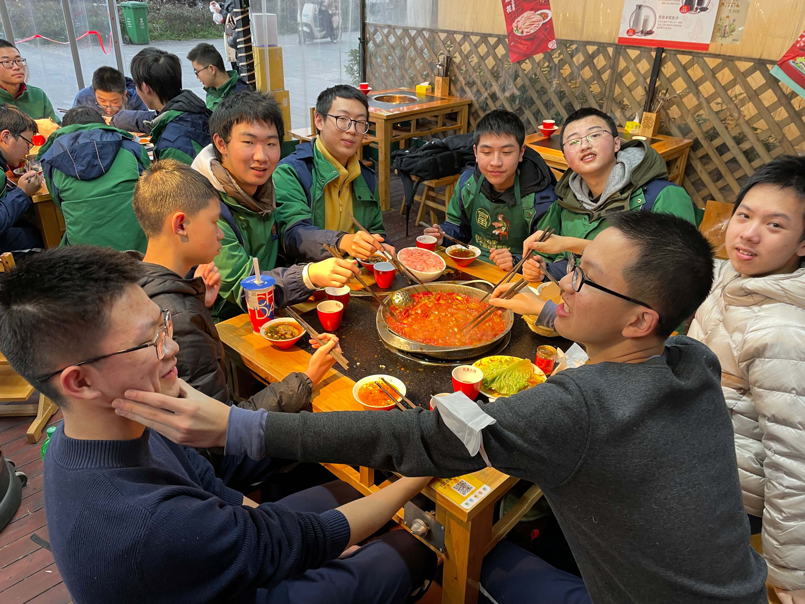
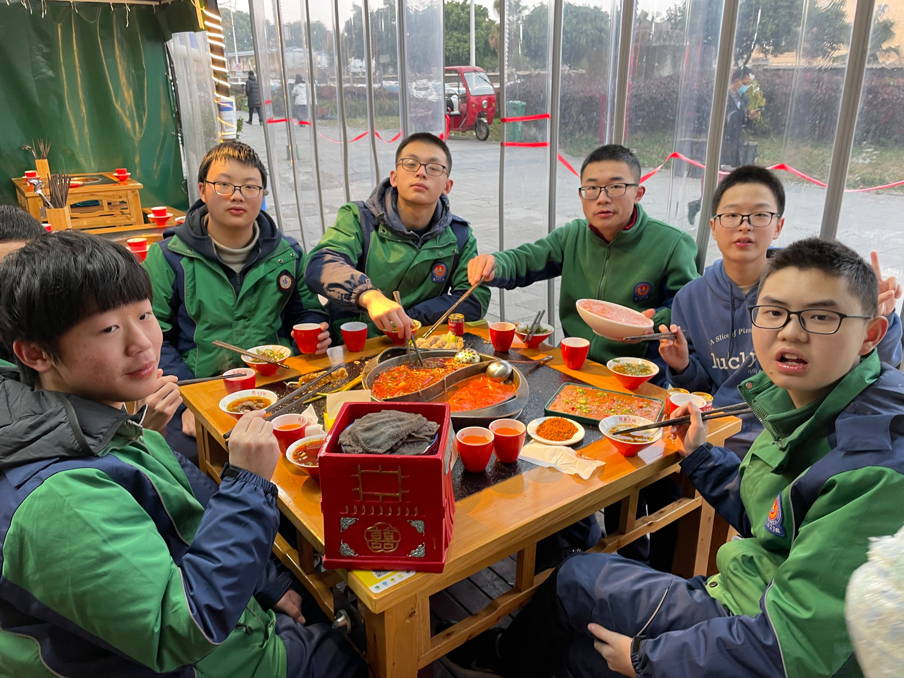

昨天教练请我们吃了散伙饭，还是挺感慨的，cwoi 高一就只剩我们这么点了，又走了一些。

唯一惭愧的是，其它人都是去冲省队的，只有我和 xyh 的目标仅仅是 noip 1= 罢了。

回忆起来，其实初一初二的时候的我，水平也不是很差，甚至可以说很有希望？（

但是吧，我不知道是不是我学 OI 的方式出了问题，还是我对 OI 的态度有问题。

又或许，其实很多问题早就存在，甚至我早就意识到了？？但是我为啥没改呢？？？

前面可以说是半桶水，后面怎么说？后面是欠的账太多啦，急啦，发现自己水平不行之后绝望啦。

于是做了不少傻逼的事情，以为这样能让自己的水平在别人眼里看起来高那么一点，但是结果显然。

今天和 bwt 聊天，说到一个真实水平的事情，就是比如我偶尔能做 2200 的题，或者能做部分 2200 的题，这不代表我的水平就有 2200，可能实际上能稳定快速做出来的只有 1700，那我的真实水平应当取 $\min$。

还有就是感觉，自己构建代码的能力差了，不是说我不知道怎么做，比如说有个题我知道要扫一遍，但是具体扫的时候怎么处理，其实我往往是想不清楚，或者想到的方法不好实现，然后就开始心烦。

而且思维时常会有空档期，成绩也依赖状态，状态好的时候我能 5 min 左右快速想出一道 2200，状态不好的时候我甚至做 800 能做一个小时。

思路很多时候不连贯？比如那个 goodbye2022 的 D，可能看了一眼是没啥思路，手推几下立马出答案了，但是类似什么 ABC284D 这种题，我甚至莽了一个 PR 上去，然后现在还不知道简单做法是怎么样的，怎么想都想不清楚。

做那个 D 的时候整个人心情很振奋，外在环境再差，思路也好比泉涌，做 abc 的时候脑子和啥一样，环境再好，咋弄都烦人。

有的时候会对着一个已有的思路复读，“这里这样一下，维护，然后怎么做，然后怎么做？然后怎么做？然后怎么做？然后怎么做？然后怎么做？……随机游走……然后怎么做？……然后怎么做……？……上厕所，冷静一下应该能想出来了吧？……然后怎么做？……然后怎么做？”

其实我也很清楚应该分析问题出在什么地方，为什么不会做，但好像考场很少能维持这种清醒，重拾思路，特别是捡起已经是依托答辩的思路的时候更是，瞬间从清醒回到烦躁，然后开始复读。

生活老师说，我得学会放空，把之前的东西抛掉，比如睡个觉，做点什么高兴的事情，回来的时候就去接受新东西而不是死磕老东西，有条件的话可以寻求帮助，当然是要在新东西弄完之后再说，当然肯定很多东西都会有无法理解的地方，这个只能靠多花点时间，多请教别人了。

可能做题也要类似，抛弃原来的思路是件需要意志力的事情。

但是我还是不懂啊，我就还是这个破样子，wkm 说我应该承认自己的真实水平，我就这么菜，然后多做点符合水平的题，提升效率，他说他水平涨的最快的时候就是觉得自己非常菜，不断板刷 abc def 这样的时期。

别人给的方法不一定适用吧感觉，但有道理的还是可以沿用。

我很多东西没坚持过长时间，这也是个问题，我现在基本没有长期停课的机会了，whk 和 OI 的衔接也是一个大问题。

真的是，我日，为啥整天想那么多？你怕板刷 ABC 丢了做高档题的感觉，但是你有过吗？你不过只是在给自己的摆烂找个借口罢了！

你不想改错，只是为了摆烂而找的借口吧！你想不出来，其实是你根本就没有想吧！

真的是，我不懂你整天丧里丧气的干嘛，一个爷们整天扭扭捏捏的，喵喵叫就算了，你他妈做事情的时候能不能硬气一点？

很喜欢昨晚和室友说的一句话：你觉得很奇怪，你觉得无法理解，是因为你知道的太少了，练习的太少了！

管你吗那么多干啥，打不过初三小朋友又有啥，你只应该关心自己，你他妈先把你那破烂水平提点上去不至于那么难看好不好？？？？

从现在开始，你是噗叽一等奖小朋友，你没有提高一等奖水平，你也不知道SAM，带花树，点分治都是什么，你只知道你今年要拿 NOIP1=，至少别那么丢人，学 OI 多少年了你没点 B 树？有效时间又多少你没点 B 数？

完全可以理解，我觉得你学 OI 的时间就和普及组小朋友差不多，有效时间就那么点。

承认吧，你就是这样，你不愿意再这样就得承认，没水平就是没水平，该练习就是要练习。

